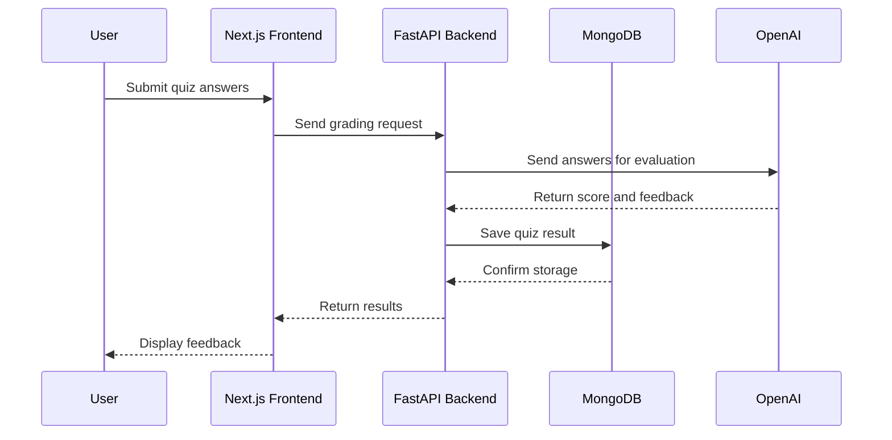

# Feature Flow Documentation
**Last Updated:** June 2025
**Related PR:** #112

This document explains the main application workflows, including user actions, frontend behavior, backend processing, API communication, and data flow.

---

# 1. Folder Management

## Overview

Users can organize generated quizzes into folders to make their quiz library easier to manage.

Users can:

* Create folders
* Rename folders
* Delete folders
* Add quizzes to folders
* Move quizzes between folders
* Remove quizzes from folders

---

## User Flow

```text
Generate Quiz
      ↓
Save Quiz
      ↓
Select Folder
      ↓
Quiz Added To Folder
      ↓
View Organized Quiz Library
```

---

## Technical Flow

```text
User selects a folder
          ↓
Frontend sends folder and quiz information
          ↓
FastAPI validates user ownership
          ↓
Database updates quiz-folder relationship
          ↓
Frontend refreshes folder contents
```

---

## Key Actions

| Action                  | Description               | API Endpoint                                |
| ----------------------- | ------------------------- | ------------------------------------------- |
| Create Folder           | Create a new folder       | POST `/api/folders/create`                  |
| View Folders            | Retrieve user folders     | GET `/api/folders/`                         |
| Rename Folder           | Update folder name        | PUT `/api/folders/{id}/rename`              |
| Delete Folder           | Remove a folder           | DELETE `/api/folders/{id}`                  |
| Add Quiz To Folder      | Add quiz to folder        | POST `/api/folders/{id}/add_quiz`           |
| Remove Quiz From Folder | Remove quiz from folder   | DELETE `/api/folders/{id}/remove/{quiz_id}` |
| Move Quiz               | Move quiz between folders | POST `/api/folders/move_quiz`               |
| View Folder             | Get folder by ID with contents | GET `/api/folders/view/{folder_id}` |

---

## Related Files

Frontend:

```text
client/pages/folders/
client/components/home/folders/
```

Backend:

```text
server/app/db/routes/folder_routes.py
```

---

# 2. Saved Quizzes

## Overview

Users can save generated quizzes into their personal library for later access.

Saved quizzes allow users to:

* Return to previously generated quizzes
* Rename saved quizzes
* Delete saved quizzes
* Access quiz details

---

## User Flow

```text
Generate Quiz
      ↓
Click Save
      ↓
Quiz Added To Saved Library
      ↓
View Saved Quiz Later
      ↓
Rename / Delete If Needed
```

---

## Technical Flow

```text
User clicks Save Quiz
          ↓
Frontend sends save request
          ↓
FastAPI receives quiz data
          ↓
Backend creates saved quiz record
          ↓
MongoDB stores user + quiz relationship
          ↓
Saved quiz appears in user's library
```

---

## Key Actions

| Action             | Description           | API Endpoint                         |
| ------------------ | --------------------- | ------------------------------------ |
| List Saved Quizzes | View saved quizzes    | GET `/api/saved-quizzes/`            |
| Save Quiz          | Store generated quiz  | POST `/api/saved-quizzes/`           |
| View Saved Quiz    | Retrieve quiz details | GET `/api/saved-quizzes/{id}`        |
| Rename Saved Quiz  | Update quiz name      | PUT `/api/saved-quizzes/{id}/rename` |
| Delete Saved Quiz  | Remove saved quiz     | DELETE `/api/saved-quizzes/{id}`     |

---

## Related Files

Frontend:

```text
client/pages/saved_quiz/
```

Backend:

```text
server/app/db/routes/saved_quizzes.py
```

---

# 3. Quiz History

## Overview

Quiz history allows users to view previous quiz attempts, including:

* Submitted answers
* Scores
* Quiz results
* Previous attempts

---

## User Flow

```text
Take Quiz
      ↓
Submit Answers
      ↓
AI Grades Responses
      ↓
Score Generated
      ↓
Attempt Saved
      ↓
View Quiz History
```

---

## Technical Flow

```text
User submits quiz answers
          ↓
Frontend sends answers to FastAPI
          ↓
Backend processes grading request
          ↓
AI grading service evaluates responses
          ↓
Score and feedback generated
          ↓
Result stored in MongoDB
          ↓
Quiz history updated
          ↓
Frontend displays results
```

---

## Key Actions

| Action               | Description            | API Endpoint                    |
| -------------------- | ---------------------- | ------------------------------- |
| View History         | List previous attempts | GET `/api/quiz-history`         |
| View History Entry   | View specific attempt  | GET `/api/quiz-history/{id}`    |
| Delete History Entry | Remove history record  | DELETE `/api/quiz-history/{id}` |

---

## Related Files

Frontend:

```text
client/pages/quiz_history/
```

Backend:

```text
server/app/db/routes/save_quiz_history.py
```

---

# 4. AI Grading

## Overview

AI grading evaluates user answers and generates:

* Scores
* Feedback
* Performance insights

The grading process uses AI services to analyze submitted answers.

---

## User Flow

```text
Take Quiz
      ↓
Submit Answers
      ↓
AI Evaluates Responses
      ↓
Receive Score + Feedback
      ↓
View Results
```

---

## Technical Flow

```text
User submits answers
          ↓
Frontend sends grading request
          ↓
FastAPI receives quiz + answer data
          ↓
Backend sends data to AI service
          ↓
AI service (OpenAI, HuggingFace, etc.) generates evaluation
          ↓
Backend processes AI response
          ↓
Results returned to frontend
          ↓
User sees score and feedback
```

---

## Key Actions

| Action           | Description                | API Endpoint              |
| ---------------- | -------------------------- | ------------------------- |
| Submit Quiz      | Submit answers for grading | POST `/api/grade-answers` |
| Retrieve Results | Fetch quiz results         | GET `/api/get-questions`  |

---

## Related Files

Frontend:

```text
client/pages/quiz_display/
```

Backend:

```text
server/app/quiz/utils/ai_grading.py

server/app/quiz/utils/grading.py
```

---

# Application Data Flow

The general application architecture follows this pattern:

```text
User

 ↓

Next.js Frontend

 ↓

FastAPI Backend

 ↓

MongoDB Database

 ↓

External Services

(OpenAI, HuggingFace, etc.)
```

---

# Sequence Diagram



---

# Summary

The main feature flows follow this pattern:

```text
User Action
      ↓
Frontend Interaction
      ↓
Backend API Request
      ↓
Database / AI Processing
      ↓
Response Returned
      ↓
UI Updated
```

This structure helps developers understand how features move through the application from user interaction to backend processing and final output.
